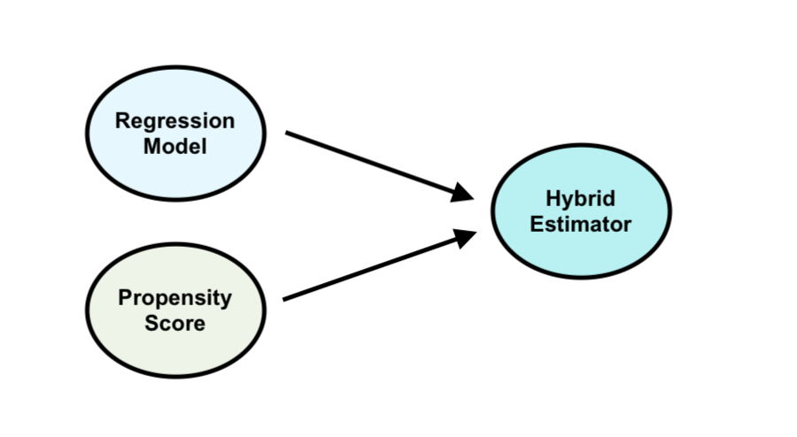
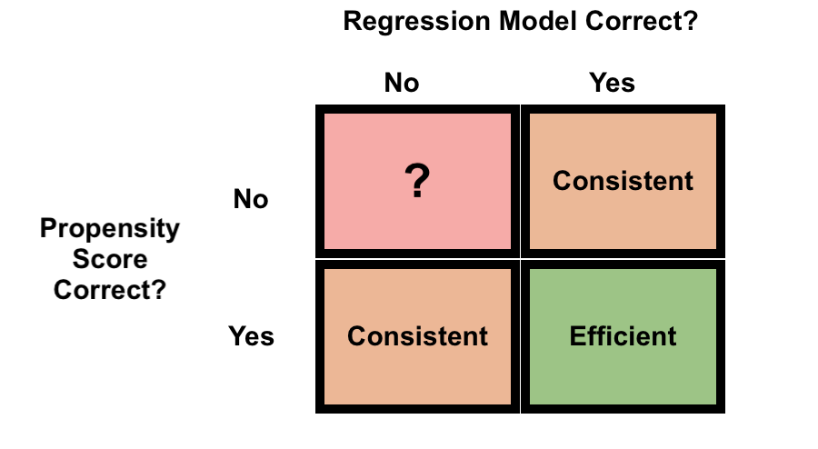

```{css echo = FALSE}

.red { color: #DA291C}

.blue { color: #005EB8}

```

---
class:inverse, bottom, right
background-image: url(handshake_edited.png)
background-size: cover
## Doubly Robust Estimators for Robust Causal Inference

.bottom-left[
#### Scott Coggeshall, PhD
#### VA Puget Sound, Denver/Seattle COIN
]
---
class: center, middle

# Motivation - (Model) Robust Causal Inference


---
class:inverse, center, middle

# Defining the Goal
---
# Defining the Goal


--

Perform causal inference in observational data using a statistical model that is robust

--

Robust to...

--

- outliers `r emo::ji('x')`

--

- unmeasured confounding `r emo::ji('x')`


--

- model misspecification `r emo::ji("check")`


--

Maintain .blue[good statistical properties] even if parts of our model are .red[wrong]
---


class: inverse, center, middle

# Causal Estimands, Non-parametrically Defined

---

background-image: url(population_of_interest.png)


---
background-image: url(population_with_counterfactuals.png)

---
background-image: url(counterfactuals_with_riskfactor.png)

---


background-image: url(counterfactuals.png)

---
background-image: url(counterfactuals_with_probs.png)

---

background-image: url(counterfactuals_with_estimands.png)

---

background-image: url(counterfactuals_with_observed.png)

---
# Notation `r emo::ji('sleeping_face')`

--

- $Y$ - outcome of interest
- $Z$ - binary exposure of interest
- $X$ - confounder(s)

--


- $Y(1)$ - counterfactual outcome under exposure
- $Y(0)$ - counterfactual outcome under non-exposure

--

Target causal estimand is the Average Treatment Effect (ATE)

$$
ATE := E[Y(1)] - E[Y(0)]
$$


---


---

class: 
# The Two Cultures (or, Regressioncels vs. Propensity Rotators)

--

How to account for confounding in observational setting?

--

.pull-left[


Regression model:

$$
E[Y \mid Z, X]
$$


Counterfactual predictions:

$$
\begin{align*}
\hat{Y}_1 &= \hat{E}[Y \mid Z = 1, X] \\
\hat{Y}_0 &= \hat{E}[Y \mid Z = 0, X]
\end{align*}
$$


Marginalize

$$
\begin{align*}
\widehat{ATE} = \frac{1}{n} \sum_{i = 1}^n \hat{Y}_{1i} - \hat{Y}_{0i}
\end{align*}
$$


$$
E[Y \mid Z, X] = \beta_0 + \beta_1 Z + \beta_X X
$$

]

---
class: 
# The Two Cultures (or, Regressioncels vs. Propensity Rotators)


How to account for confounding in observational setting?


.pull-left[

Regression model:

$$
E[Y \mid Z, X]
$$


Counterfactual predictions:

$$
\begin{align*}
\hat{Y}_1 &= \hat{E}[Y \mid Z = 1, X] \\
\hat{Y}_0 &= \hat{E}[Y \mid Z = 0, X]
\end{align*}
$$


Marginalize

$$
\begin{align*}
\widehat{ATE} = \frac{1}{n} \sum_{i = 1}^n \hat{Y}_{1i} - \hat{Y}_{0i}
\end{align*}
$$
$$
E[Y \mid Z, X] = \beta_0 + \beta_1 Z + \beta_X X
$$


]

.pull-right[

Propensity score model:

$$
P(Z \mid X)
$$


Propensity score weights:

$$
\begin{align*}
w = \left\{ \begin{aligned}
  \frac{1}{\hat{P}(Z \mid X)} &\qquad \text{Exposed} \\
  \frac{1}{1 - \hat{P}(Z \mid X)} &\qquad \text{Unexposed}
  \end{aligned}
  \right.
\end{align*}
$$


$$
\begin{align*}
\widehat{ATE} = \frac{1}{n_1} \sum_{i: Z_i = 1} w_i Y_i  - \frac{1}{n_0} \sum_{i: Z_i = 0} w_i Y_i
\end{align*}
$$

$$
logit^{-1}(P(Z \mid X)) = \alpha_0 + \alpha_1 X
$$

]
---
# Doubly Robust Estimators 

--

Regression works great...

--

...*if* the regression model is correctly specified

--

Propensity score weighting works great...

--

...*if* the propensity score model is correctly specified

--

Under correct specification, both approaches can provide *consistent* and *asymptotically normal* estimation 

---

.pull-left[

# Consistency: 
Estimates converge to the .red[truth] as sample size increases

```{r echo = FALSE, message = FALSE, warning = FALSE}

library(tidyverse)
library(ggplot2)
library(ggthemes)
B <- 10000

sample_means <- sapply(1:B, function(x) mean(sapply(10000, function(y) mean(rbinom(n = x, size = 1, prob = .5)))))
consistency_plot_dat <- data.frame(x = 1:B, y = sample_means)


consistency_plot_dat %>% ggplot(aes(x = x, y = y)) + geom_line(alpha = .8, linewidth = 1.5) + 
  geom_hline(yintercept = .5, col = 'red', linewidth = 2) + 
  labs(x = expression(n %->% infinity) ) + cowplot::theme_nothing() + theme(axis.title.x = element_text(size = 50), axis.ticks.x = element_blank(), axis.text.x = element_blank())


```

]

--

.pull-right[

# Asymptotic normality:
Sampling distribution of estimates converges to a Normal distribution centered around the .red[truth]

```{r echo = FALSE, message = FALSE, warning = FALSE}


B <- 10000

sample_means <- sapply(1:B, function(x)  mean(rnorm(100)))
consistency_plot_dat <- data.frame(x = 1:B, y = sample_means)


consistency_plot_dat %>% ggplot(aes( x = y)) + geom_density(fill = "blue", color = "blue", alpha = .2) + 
  geom_vline(xintercept = 0, col = 'red', linewidth = 2) + 
  labs(x = expression(hat(theta))) + cowplot::theme_nothing() + theme(axis.title.x = element_text(size = 50), axis.ticks.x = element_blank(), axis.text.x = element_blank())


```


]


---
# Doubly Robust Estimators





---




---
# Doubly Robust Estimator of ATE

--

Suppose we have a fitted .red[outcome regression model] $\hat{E}[Y \mid Z, X] and a fitted .blue[propensity score model] $\hat{\pi}$
--

$$
\begin{align*}
\widehat{ATE}_{DR} &= \frac{1}{n} \sum_{i=1}^n \left( \frac{Z_i Y_i}{\color{blue}{\hat{\pi}_i}} - \frac{Z_i - \color{blue}{\hat{\pi}_i}}{\color{blue}{\hat{\pi}_i}} \times \color{red}{\hat{E}[Y \mid Z = 1, X_i]} \right) \\
&\qquad - \frac{1}{n} \sum_{i = 1}^n \left( \frac{(1 - Z_i) Y_i}{\color{blue}{\hat{\pi}_i}} - \frac{Z_i - \color{blue}{\hat{\pi}_i}}{\color{blue}{\hat{\pi}_i}} \times \color{red}{\hat{E}[Y \mid Z = 0, X_i]} \right)
\end{align*}
$$


---
class:inverse, center, middle


> "All models are wrong, but some are useful" 
>      
> \- George E.P. Box

---
# All Models are Wrong, so is Double Robustness Useful?

--

#### $$P(\text{Parametric Regression Model is Correct}) \approx 0$$


--


#### $$P(\text{Parametric Propensity Score Model is Correct}) \approx 0$$


--

# $$"\approx 0" + "\approx 0" \approx 0!$$

---
class: inverse, middle, center

# Machine Learning + Doubly Robust Estimation


---
# Machine Learning + DR

--

Doubly robust estimator needs *predictions*

--


ML algorithms are great at generating predictions under *minimal* assumptions about the data generating process

--

Statistical inference with ML?

--


---
# Machine Learning + DR

--


--


$$
\begin{align*}
\widehat{ATE}_{DR} &\approx \color{blue}{ATE} +\\
&\qquad (\color{red}{\text{Bias from Propensity Score}}) \times (\color{red}{\text{Bias from Regression Model}})
\end{align*}
$$


---
class: inverse

# Wrapping Up

---
# Summary


---
# Extensions - Other data mechanisms

--

## `r emo::ji('magnifying')` Missing data `r emo::ji('magnifying')`

--

## `r emo::ji('face_with_symbols_on_mouth')` Censored data `r emo::ji('face_with_symbols_on_mouth')`


---


---
# Drawbacks 

- Efficiency loss 
 - lower power, wider confidence intervals
 
--

- Guarantees happen as $n \rightarrow \infty$

--

- Marginal vs Conditional estimands

--

- Hyper-focused on a single estimand


--

- Bias/variance trade-off


